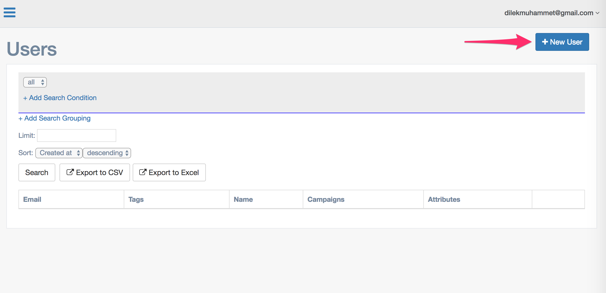
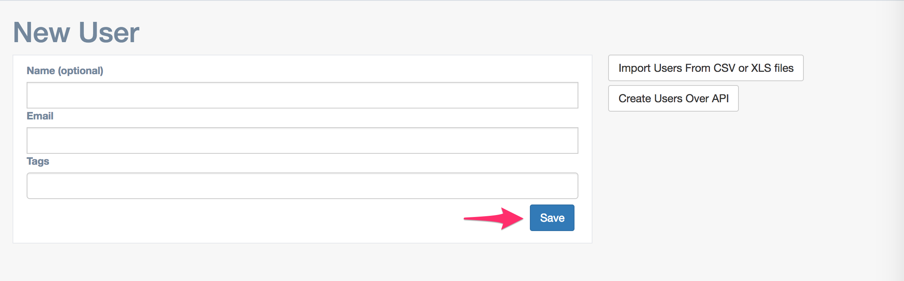
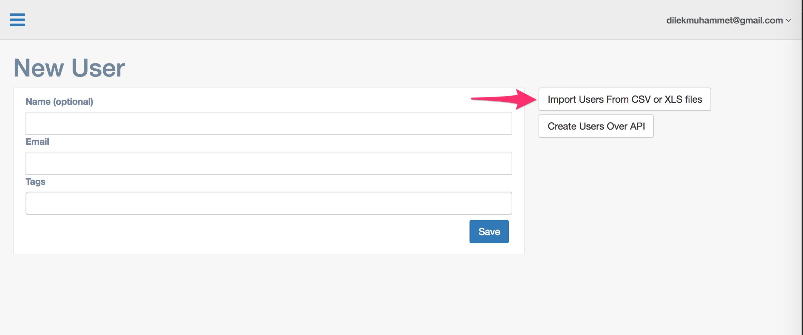
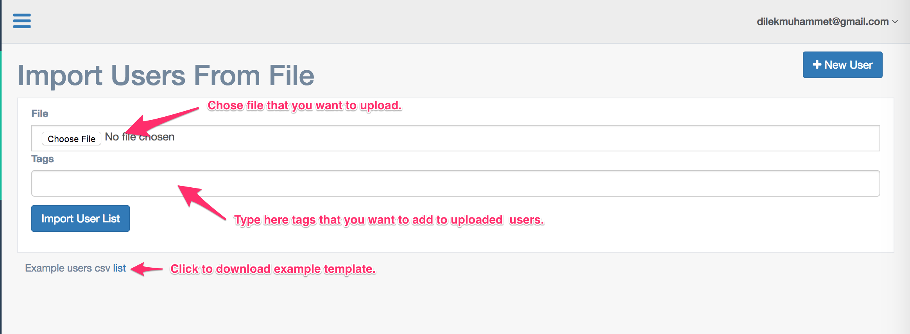
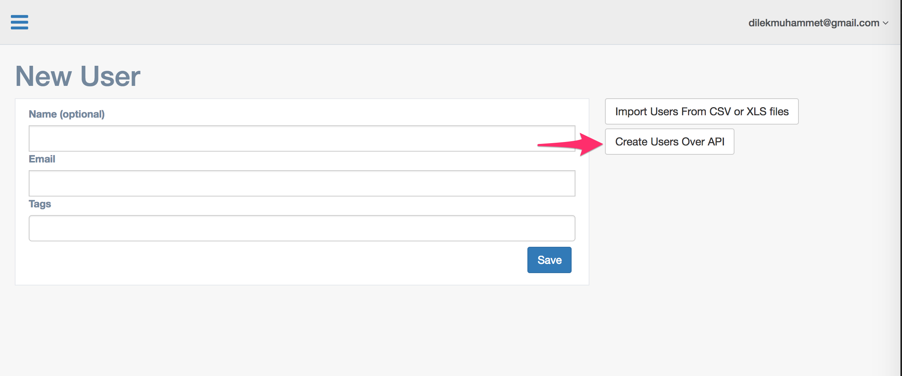
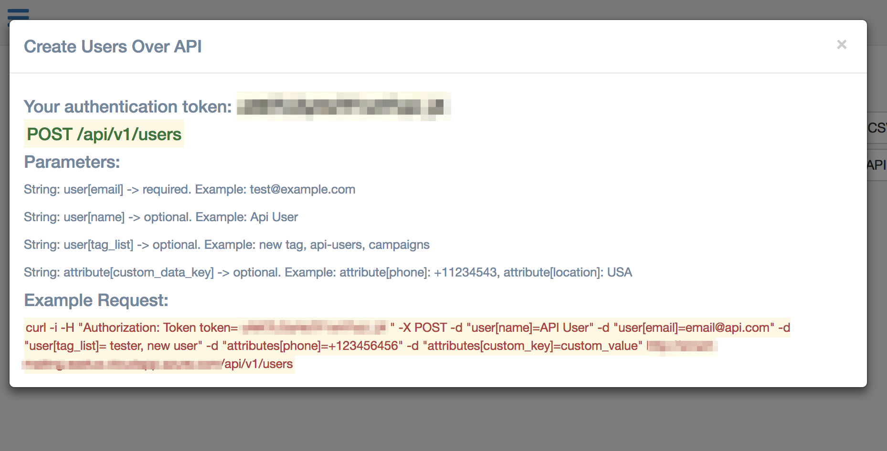

# Create User

There are 3 ways to create a user.

## 1. New user form

* Click the `New User` button. 

* Fill the form and click the `Save` button. 

## 2. Import from csv or xls files

* Click the `Import Users From CSV or XLS files` button. 

* Choose file that you want to upload, fill the form and click `Import User List` button. 


## 3. Over the API

* Click the `Create User Over API` button. 

* Grab your authentication token. 

* POST to `{your_domain}/api/v1/users` with post data `user`. 
  Example post data: 
  
  ```bash
  curl -i -H "Authorization: Token token= uNKTLDyHsTF1xHTqU_jX " -X POST -d "user[name]=API User" -d "user[email]=email@api.com" -d "user[tag_list]= tester, new user" -d "attributes[phone]=+123456456" -d "attributes[custom_key]=custom_value" http://your-domain.com/api/v1/users
  ```